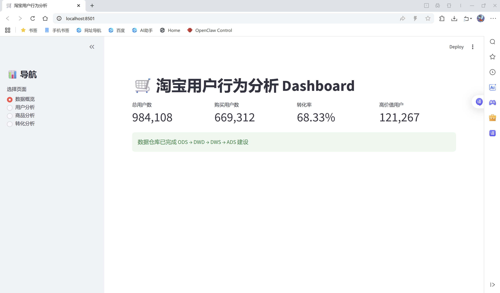
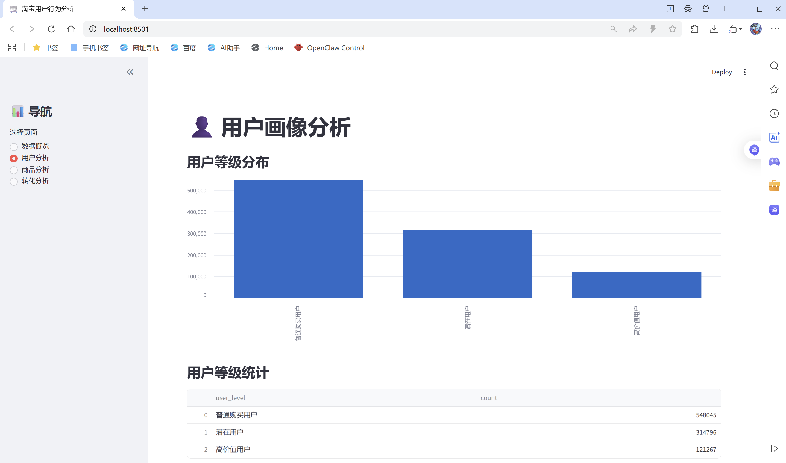
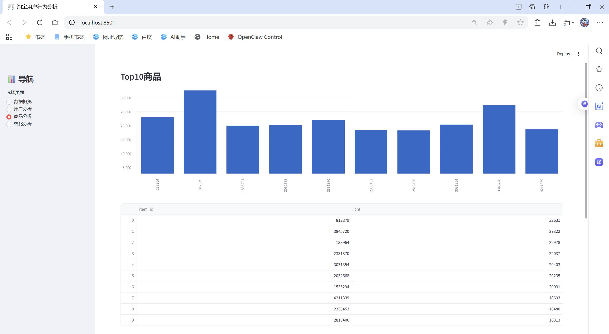
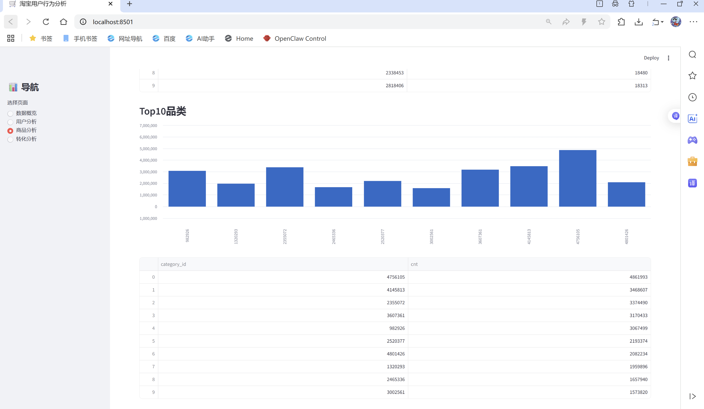
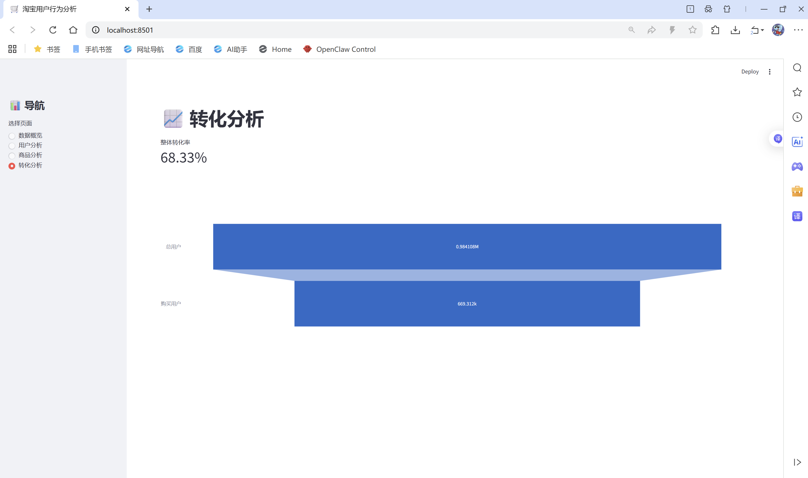

# Ecommerce User Analysis

基于淘宝用户行为数据集构建的数据仓库与用户分析项目。

## 项目架构

ODS → DWD → DWS → ADS

### ODS（原始层）

存储原始淘宝用户行为数据

### DWD（明细层）

完成数据清洗与字段标准化

### DWS（汇总层）

构建用户画像

* 浏览次数
* 收藏次数
* 加购次数
* 购买次数
* 用户等级

### ADS（应用层）

生成业务分析指标

* Top10商品
* Top10品类
* 用户转化率

---

## 技术栈

* Python
* Pandas
* SQLite
* SQL
* Streamlit
* Matplotlib
* Git/GitHub

---

## Dashboard

### 数据概览

### 用户分析

### Top10商品排行

### Top10品类排行

### 转化分析

---

## 项目成果

* 构建ODS-DWD-DWS-ADS四层数据仓库
* 处理百万级用户行为数据
* 建立用户分层模型
* 构建商品与品类排行榜
* 搭建Streamlit可视化分析平台
